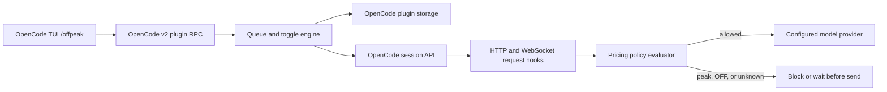
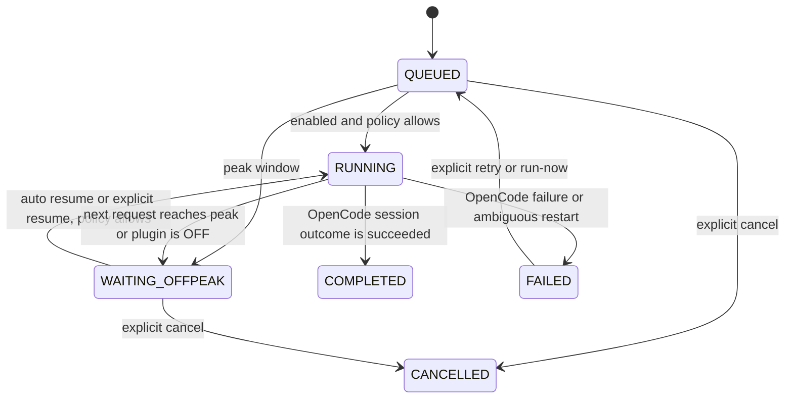

# Architecture

`opencode-offpeak` is one npm package with two OpenCode v2 entrypoints:

- `./server` owns the request guard, queue scheduler, config file, and OpenCode plugin-storage state.
- `./tui` registers `/offpeak` through the v2 keymap slash-command API and sends typed local RPC calls to the server entrypoint.

The plugin does not run a second agent runtime. OpenCode owns the sessions, model/provider, permissions, tools, transcript, and project context.

## State and persistence

The queue is one versioned JSON document in OpenCode plugin storage. Each task stores its ID, prompt, working directory, provider/model, policy ID, state, explicit OpenCode session ID, timestamps, retry metadata, last error, and any expiring override. There is no database or second queue service.

The setting file is `$OPENCODE_CONFIG_DIR/offpeak.json` when `OPENCODE_CONFIG_DIR` is set; otherwise it is `$XDG_CONFIG_HOME/opencode/offpeak.json`, defaulting to `~/.config/opencode/offpeak.json`. `OPENCODE_OFFPEAK_CONFIG` can override the file path. It is canonical for the persistent enabled toggle, execution mode, display timezone, and policy definitions. Commands write it atomically with owner-only permissions. The queue remains in OpenCode storage.

## State machine

OFF does not delete state. It stops automatic starts and resumes. If a queued task is already active, the request guard allows the in-flight provider request to settle and blocks its next inference request. It preserves the session. OFF does not authorize peak pricing.

## Request guard and policy evaluation

The server plugin attaches through `context.session.hook()` to OpenCode v2's `http.request`, `experimental.ws.handshake`, and `experimental.ws.send` hooks. These run before the provider transport sends the request/frame. A blocked interactive request throws a useful error. A queued `auto` task transitions to `WAITING_OFFPEAK` and holds that same session at the request boundary until the plugin is enabled and the pricing policy allows it (or its explicit override is still valid).

Policy matching uses provider IDs and exact/glob model IDs. A configured provider with an unknown model is `UNKNOWN` and blocked. Invalid timezone or schedule data is blocked. Providers without an installed policy are `UNTRACKED`; they are not covered by this plugin until a policy is added. Queue tasks must match a valid policy.

The built-in `deepseek-opencode-go` policy is defined once in `src/policy.ts`, in UTC. Time evaluation uses `Intl.DateTimeFormat` and the policy's IANA timezone, including weekday changes and DST. The user's display timezone does not change pricing boundaries.

## Queue execution and sessions

The scheduler is sequential. It has no polling loop: pending work schedules one timer for the next policy boundary, while a request already waiting sleeps on a signal and boundary timer. A task gets a new OpenCode session once. Pause/resume reuses the persisted session ID; a failed task can only continue after an explicit retry.

Completion uses OpenCode's session outcome (`succeeded`) after the session wait operation. Process exit alone does not complete a task. A session idle without a successful outcome is marked failed and requires an explicit retry.

## Recovery and delivery guarantees

OpenCode's v2 recovery is at-least-once, not exactly-once. If the plugin finds a task in `RUNNING` after plugin/server startup, it waits for its stored session. If OpenCode reports success, the task completes. Otherwise the outcome may be ambiguous, so the plugin marks it `FAILED` and does not send a duplicate prompt automatically. The user can inspect and explicitly retry the same session.

A `WAITING_OFFPEAK` record is written before the guarded request is allowed. That state is safe for automatic same-session resume in `auto` mode. A running OpenCode server is required for automatic timers; the plugin does not install or operate a separate daemon. The supported OpenCode background service can remain running when the TUI terminal closes. Machine-restart startup is delegated to the host OS service manager if desired.

## Override

`/offpeak run-now <task-id>` is a task-scoped, 15-minute override. It is persisted with an absolute expiry and shown in status while active. OFF pauses its use; it does not create or extend it. Expiry returns the next provider request to normal policy enforcement.

## Intentionally outside the architecture

- No second agent runtime, external scheduler, helper daemon, database, provider proxy, telemetry, billing aggregator, or web dashboard.
- No global `--continue` or implicit “last session” selection.
- No guarantee that a provider request already accepted before a boundary can be recalled.
- No exactly-once provider semantics across a crash where the provider outcome is ambiguous.
